# ManaGit Preview
### Here you have some screenshot of ManaGit working.
## Program initialization
### As ManaGit starts, it shows all options you can run in it (note that Ctrl will not work while ManaGit is running)
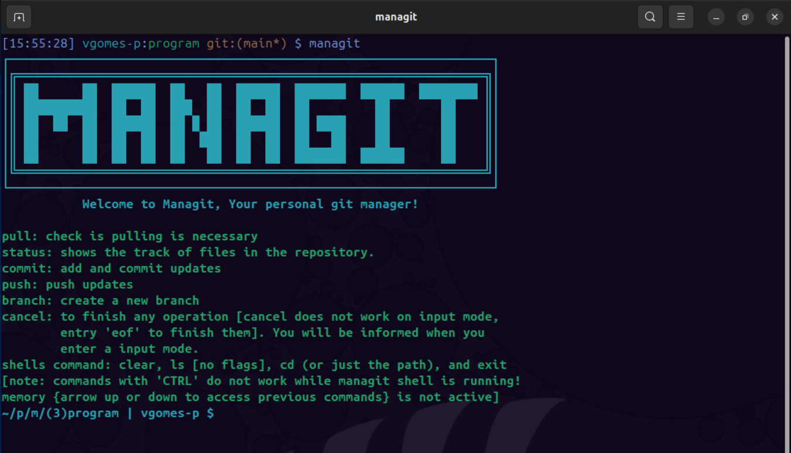

### Note that managit prompt is something like `~/p/m/(3) | vgomes-p $`, the number within the parenthesis is the number of directories you are in from main, and the letters between the slash (/) is the first letter of the directories. The prompt only display the name of your current directory. The prompt will also show the user name (`$USER`) when it is your entry and "managit" when it is managit's entry.

## Commit with untracked files
### If you run `commit` with untracked files, ManaGit warns you about them and ask if you wish to continue without adding them to track.
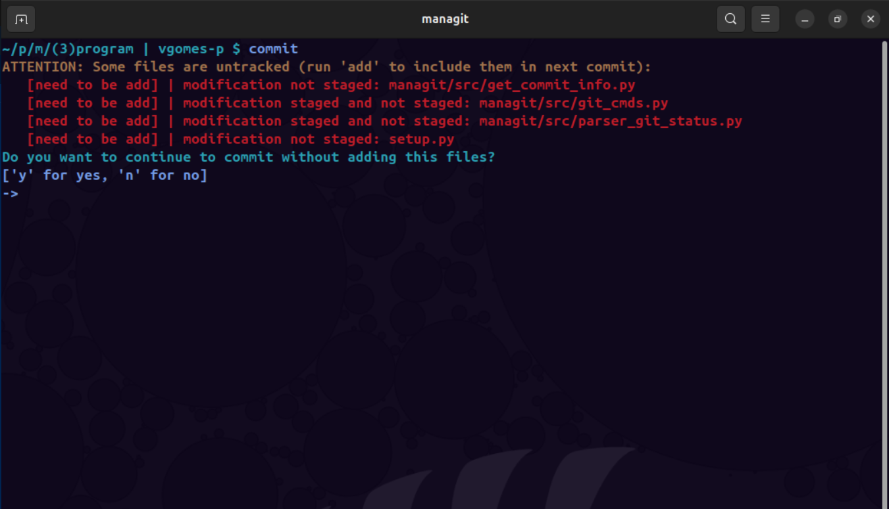

## Status with untracked files
### No new news here, just `status` working as it should, the difference is that, in ManaGit, it tells you more information about the files stages (not just "modified" or "deleted")
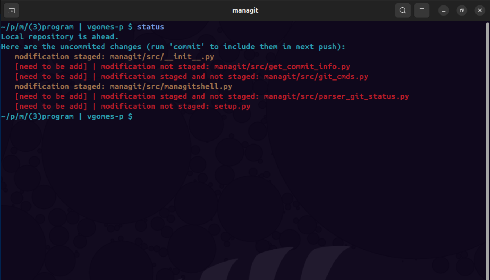
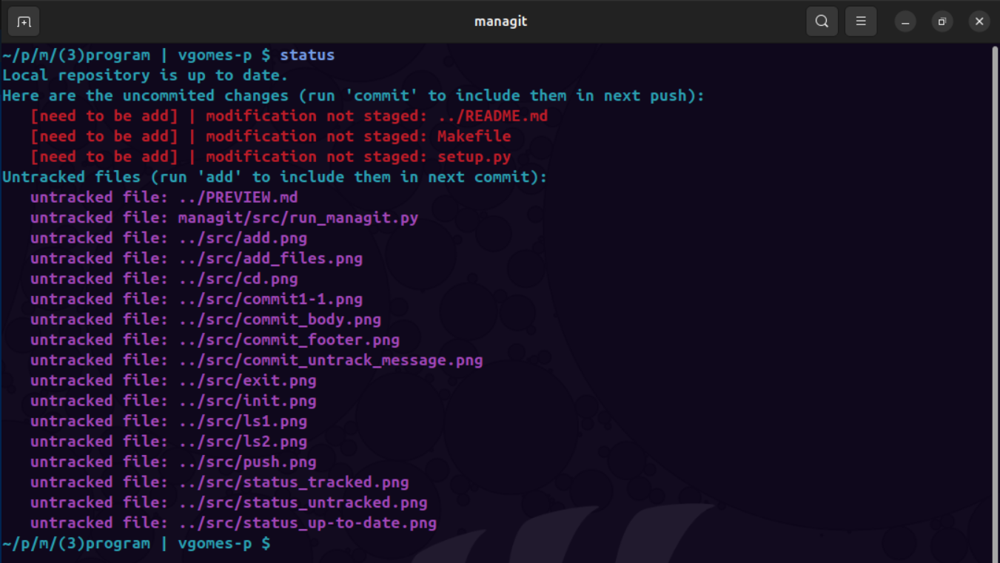

## Adding files
### Adding files work just with ., path, or files name
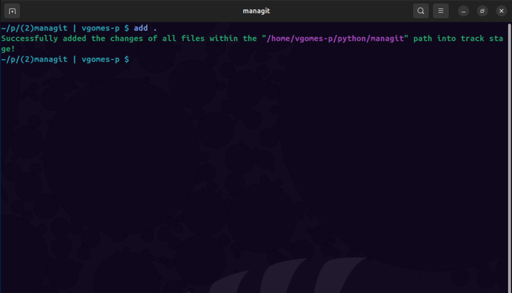
### by the way, * and {0..9} works was well (note that the files must be separated by space, no comma needed)
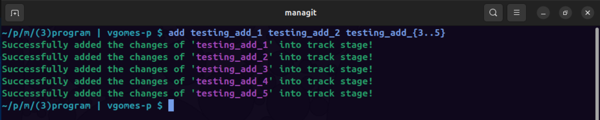

## Status with tracked files
### This is `status` return with all files tracked and staged
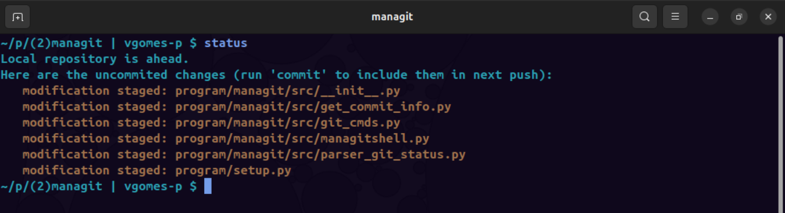

## Commit header (mandatory)
### Now you may commit, `commit` starts with some chosing-option question, followed by a single-line input mode to build the commit's header
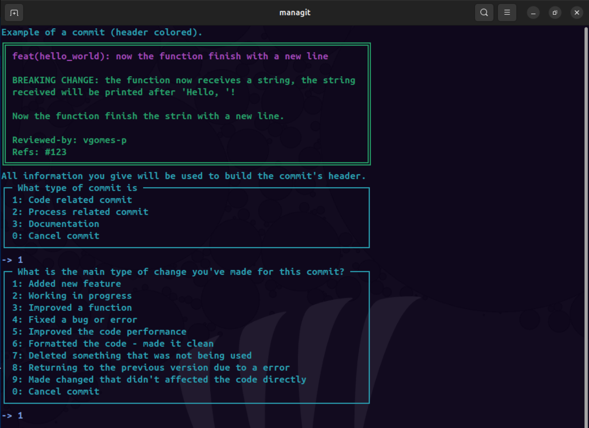

## Commit body maker (optional)
### Commit's body is an option and oportunity to give a more detailed changes explanation to your commit. It allows you to add multiple multiple-line texts.
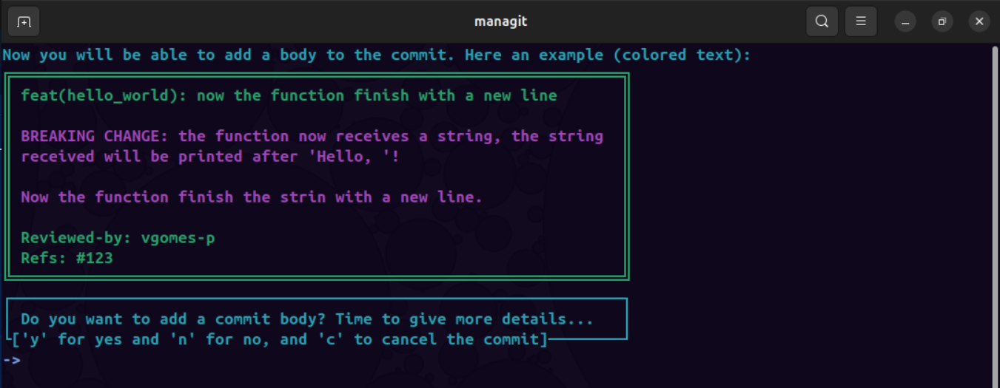

## Commit footer maker (optional)
### Commit's footer is a place to inform the reviewer's tag, name, id or email, the reference and any other details. After collection the "Reviewed-by" and "Refs", you will be able to add ONE multiple-lines text
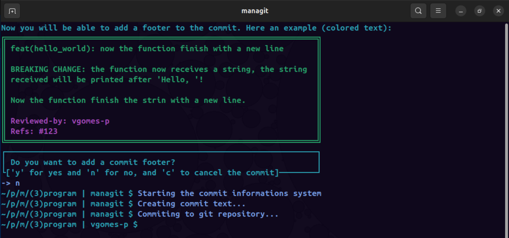

## Push
### Well, `push` pushes things that are commited... Nothing new under the sun here...
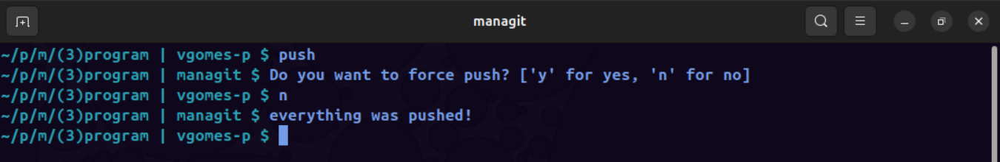

## Status with up-to-date repository
### Finally, the "You are up-to-date" message...
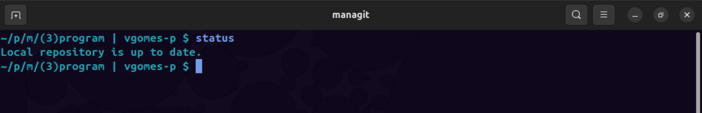

## List files do work, I'm not lying
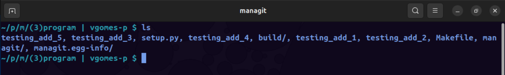
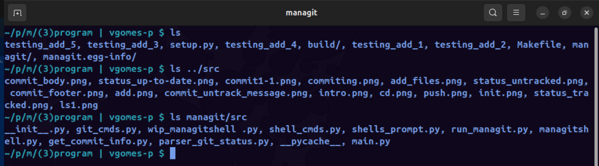

## Would you like to navigate?
### You only cannot navigate to home with "~"...
> [Note: path finder it to be updated]

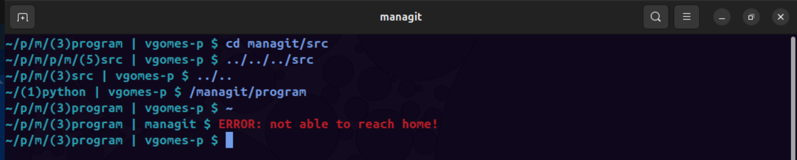

## Bye
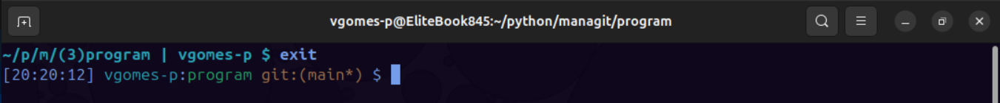
