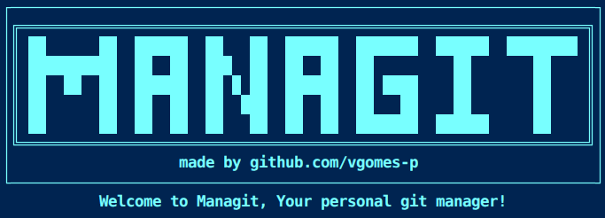
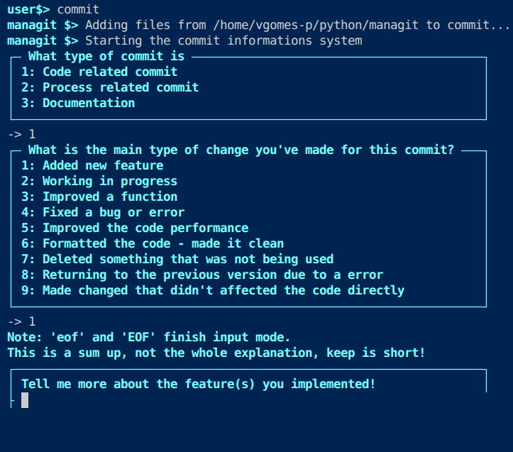

# ManaGit | Your Personal Git Manager 🚀


A simple, interactive CLI tool that helps you manage your Git repositories with an intuitive shell interface. Perfect for developers who want a streamlined workflow for pulling, committing, and pushing changes.



## Features

- **Interactive shell** with a clean, colorful interface
- `pull` — Check if you're behind origin and pull automatically
- `commit` — Smart guided commit process using conventional commit style prefixes:
  - `feat:`, `fix:`, `refactor:`, `perf:`, `style:`, `chore:`, etc.
  - Interactive prompts for commit type and detailed description
- `push` — Push changes (with optional force push)
- `clear` — Clear the screen
- Beautiful ASCII art on startup
- Safe signal handling (blocks Ctrl+C inside the shell)

## Installation

### From source (recommended during development)

```bash
cd project
pip install -e .
```
This will install the managit command globally (editable mode).

### Build & Install
```Bash
cd project
make install
```

### Usage
Simply run:
```Bash
managit
```
Or:
```Bash
managit --start
```
## Commands inside the shell

- pull — Pull latest changes from remote
- commit — Stage all changes and create a guided commit
- push — Push to remote (asks if you want --force)
- clear — Clear terminal screen
- exit — Exit managit

## Project Structure
```text
managit/project/
├── 📁 managit
│ ├── 📁 src
│ │ ├── 🐍 __init__.py
│ │ ├── 🐍 get_commit_info.py
│ │ ├── 🐍 main.py
│ │ └── 🐍 managitshell.py
│ ├── 📁 utils
│ │ ├── 🐍 __init__.py
│ │ ├── 🐍 clear.py
│ │ ├── 🐍 colors.py
│ │ └── 🐍 nbr.py
│ └── 🐍 __init__.py
├── 📄 Makefile
└── 🐍 setup.py
```

## Tech Stack

Python 3.6+
setuptools for packaging
subprocess for Git integration
Custom colored terminal output

## License
This project is licensed under the MIT License — see the LICENSE file for details.

## Author
Made by Vinny (@vgomes-p)

## Happy coding!
Feel free to open issues or submit PRs.